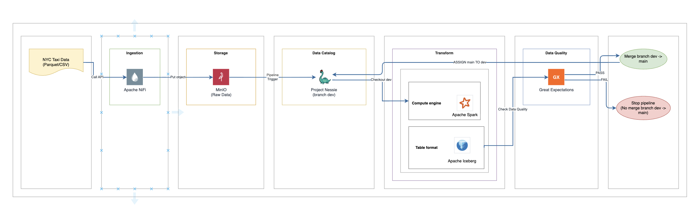

# Data Engineering Lakehouse Project

Dự án này xây dựng một hệ thống Data Lakehouse hoàn chỉnh để thực hành pipeline ETL từ thu thập, lưu trữ, đến xử lý và quản lý phiên bản dữ liệu. Dự án sử dụng tập dữ liệu thực tế **NYC Taxi Trip Data** để minh hoạ.

## 1. Tech Stack

Để xây dựng hệ thống Lakehouse, dự án kết hợp các công cụ mã nguồn mở mạnh mẽ sau:

- **Apache NiFi**: Đóng vai trò là công cụ **Data Ingestion**. NiFi sẽ tự động tải raw data từ nguồn Internet (hoặc API), kiểm tra cơ bản và đẩy vào kho lưu trữ (MinIO).
- **MinIO**: Đóng vai trò là **Object Storage** (tương tự Amazon S3). Tất cả raw data và processed data đều nằm tại đây.
- **Apache Spark**: Đóng vai trò là **Data Processing Engine**. Spark sẽ đọc dữ liệu từ MinIO, thực hiện các tác vụ ETL, làm sạch, biến đổi, aggregate và ghi dữ liệu đầu ra.
- **Apache Iceberg**: Đóng vai trò là **Table Format**. Khi Spark ghi dữ liệu trở lại MinIO, nó sẽ ghi dưới định dạng Iceberg, giúp dữ liệu có tính ACID (hỗ trợ update, delete, time-travel) giống như một database truyền thống trên nền tảng Data Lake.
- **Project Nessie**: Đóng vai trò là **Data Catalog & Version Control**. Nessie quản lý metadata của Iceberg, cung cấp các tính năng quản lý phiên bản dữ liệu (branch, merge, rollback).
- **Dagster**: Đóng vai trò là công cụ **Data Orchestration**. Dagster sẽ điều phối và quản lý toàn bộ pipeline ETL, theo dõi sự phụ thuộc giữa các tác vụ (assets/ops) và kích hoạt các job Spark chạy tự động.
- **Trino**: Đóng vai trò là **Interactive Query Engine**. Trino kết nối trực tiếp tới Nessie catalog (branch `main`) để truy vấn SQL nhanh trên các bảng Iceberg ở tầng gold/silver, không cần khởi động Spark.
- **Marquez + OpenLineage** (tùy chọn, on-demand): Đóng vai trò là **Data Lineage & Metadata**. Dagster phát sự kiện OpenLineage (schema, column lineage, kết quả data quality) qua sensor; Marquez thu thập và trực quan hóa lineage giữa các asset. Chạy tách riêng để giữ stack chính nhẹ — chỉ bật khi cần khám phá/trình diễn lineage.

## 2. Data Flow



### Giải thích

1. **NiFi** tải file từ Internet về **MinIO** (raw data: parquet/csv).
2. **Nessie** tạo branch dev trước (tách nhánh riêng cho lần chạy, ví dụ `etl_run_2024_01`), checkout sang branch dev.
3. **Spark** đọc raw data từ **MinIO**, transform & ghi **Iceberg** vào MinIO — ghi trên branch dev, chưa động tới `main`.
4. **Spark** kiểm tra Data Quality bằng Great Expectations:
   - **FAIL** → ném lỗi, pipeline dừng. Dữ liệu xấu chỉ nằm trên branch dev, `main` vẫn sạch.
   - **PASS** → Spark gọi `MERGE BRANCH dev INTO main` để hợp nhất dev vào `main` trên Nessie (tạo merge commit, giữ đầy đủ lịch sử).
5. Kết quả: chỉ dữ liệu đã pass test mới chính thức nằm trên `main`.


## 3. Demo Dump Data

Dự án sử dụng tập dữ liệu NYC Yellow Taxi Trip Data - **Tháng 01 năm 2024** làm dump data để practice.

- **Nguồn**: [NYC TLC Trip Record Data](https://www.nyc.gov/site/tlc/about/tlc-trip-record-data.page)
- **Định dạng gốc**: Parquet
- **Dung lượng thô**: ~48 MB (rất phù hợp để chạy local demo)
- **Đường dẫn cục bộ**: `data/raw/yellow_tripdata_2024-01.parquet`

Dữ liệu này chứa hàng triệu bản ghi ghi lại thông tin thời gian đón/trả khách, vị trí, giá tiền, tiền tip... rất phù hợp để thực hành các nghiệp vụ:
- Làm sạch (lọc chuyến đi âm tiền, thời gian không hợp lệ)
- Khai phá (phân tích giờ cao điểm, khu vực đón khách nhiều nhất)

## 4. Cấu trúc thư mục

```text
nyc-taxi-lakehouse/
├── data/               # Nơi chứa raw dump data
├── docs/               # Tài liệu dự án
│   └── nifi.md
├── infra/              # Cấu hình hạ tầng Docker
│   ├── dagster/        # Orchestration pipeline với Dagster
│   │   ├── artifacts/
│   │   ├── spark_scripts/ 
│   │   │   ├── bronze_to_silver.py
│   │   │   ├── dq_check_gold.py
│   │   │   ├── dq_check_silver.py
│   │   │   ├── merge_branch.py
│   │   │   └── silver_to_gold.py
│   │   ├── dagster.yaml
│   │   ├── Dockerfile
│   │   ├── pipeline.py
│   │   ├── requirements.txt
│   │   └── workspace.yaml
│   ├── jupyter/        # Cấu hình Jupyter Notebook
│   │   ├── Dockerfile
│   │   └── requirements.txt
│   ├── minio/
│   │   └── Dockerfile  # MinIO custom image
│   ├── nessie/
│   │   └── Dockerfile  # Nessie custom image
│   ├── nifi/           
│   │   ├── Dockerfile
│   │   ├── Dockerfile.registry # Custom image sửa lỗi phân quyền Registry
│   │   ├── registry_db/        # Database chứa metadata của Registry
│   │   └── flow/               # Chứa file luồng (phiên bản) của dự án
│   ├── spark/
│   │   ├── config/
│   │   │   ├── log4j2.properties
│   │   │   └── spark-defaults.conf
│   │   ├── Dockerfile
│   │   └── requirements.txt
│   └── trino/
│       ├── catalog/
│       │   └── nessie.properties
│       ├── config.properties
│       ├── Dockerfile
│       ├── jvm.config
│       └── node.properties
├── notebook/           # Chứa file Jupyter Notebook
│   └── data_exploration.ipynb
├── docker-compose.yml  # Triển khai toàn bộ cụm
├── .env                # Các biến môi trường
├── .gitignore          # Cấu hình ignore cho Git
└── README.md
```

## 5. Hướng dẫn chạy

1. Khởi động toàn bộ cụm dịch vụ: `docker compose up -d`
2. Truy cập **NiFi** tại `https://localhost:8082/nifi` để thiết lập luồng Data Ingestion (Tài khoản: admin / Mật khẩu: admin123).
3. Khám phá kho lưu trữ **MinIO** tại `http://localhost:9001` (Tài khoản: admin / Mật khẩu: admin123).
4. Truy cập **Jupyter Notebook** tại `http://localhost:8888` để chạy thử các file notebook thăm dò dữ liệu.
5. Truy cập **Dagster** tại `http://localhost:3000` để chạy và theo dõi toàn bộ pipeline ETL.
6. Truy vấn dữ liệu nhanh bằng **Trino**: `docker exec -it trino trino --catalog nessie --schema gold`, sau đó chạy SQL trực tiếp (ví dụ `SELECT * FROM daily_trips LIMIT 5;`).
7. Các dịch vụ giám sát khác (Tùy chọn):
   - **Spark Master UI**: `http://localhost:8080`
   - **Spark History Server**: `http://localhost:18080`
   - **Nessie Catalog API**: `http://localhost:19120`
   - **Trino UI**: `http://localhost:8085`
8. **Data Lineage với Marquez** (Tùy chọn, on-demand): Marquez chạy tách riêng để giữ stack chính nhẹ.
   - Bật kèm stack chính: `docker compose -f docker-compose.yml -f docker-compose.metadata.yml up -d`
   - Truy cập **Marquez UI** tại `http://localhost:3001` để xem lineage giữa các asset (Dagster tự đẩy sự kiện OpenLineage khi chạy pipeline).
   - Tắt riêng Marquez (giữ stack chính chạy): `docker compose -f docker-compose.yml -f docker-compose.metadata.yml stop marquez-db marquez-api marquez-web`
